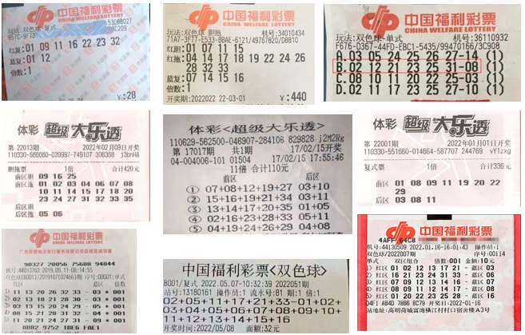
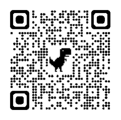
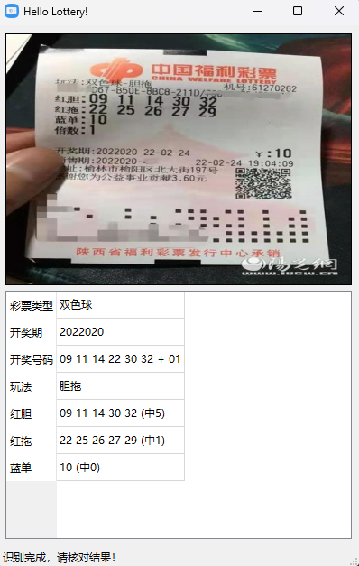
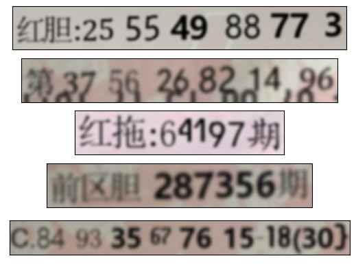

# hello-lottery

彩票OCR项目，通过神经网络识别彩票信息，给出中奖结果。目前支持体彩超级大乐透和福彩双色球，支持单式、复式、胆拖玩法。自动适应各种彩票样式和背景：

[weights下载](https://pan.baidu.com/s/1sBxFLyI3TcOIyVR9DVxYmQ)
提取码：qquj

新建一个checkouts文件夹，把下载好的weights放进去。



[点击体验](https://wushidiguo2-hellolottery.hf.space/)

或使用手机扫描二维码（无需下载）



运行界面(Windows)



## 运行环境

测试环境为Windows 11和Ubuntu 20.04，python版本为3.8.10，默认使用GPU加速，纯CPU环境下亦可运行。使用时需要联网获取开奖数据。

## 使用步骤

```bash
git clone https://github.com/wushidiguo/hello-lottery

cd hello-lottery

pip install -r requirements.txt
```

**通过图形界面使用**

```bash
python run.py
```

点击按钮选择对应彩票图片即可。

**通过命令行使用**

```bash
python lottery.py ##.jpg
```

可以使用的参数如下：

```bash
usage: lottery.py [-h] [--detector DETECTOR] [--recognizer RECOGNIZER] [--detect_conf_thres DETECT_CONF_THRES] [--detect_iou_thres DETECT_IOU_THRES] [--cert_ CERT_] [--timeout TIMEOUT] [--cuda] [--recognition_only] image

positional arguments:
  image                 image with lottery in it

optional arguments:
  -h, --help            show this help message and exit
  --detector DETECTOR   detector model file
  --recognizer RECOGNIZER
                        recognizer model file
  --detect_conf_thres DETECT_CONF_THRES
                        detection confidence threshold
  --detect_iou_thres DETECT_IOU_THRES
                        detection iou threshold
  --cert_ CERT_         API infomation
  --timeout TIMEOUT     timeout for waiting response
  --cuda                use cuda or cpu
  --recognition_only    return recognition results rather than checked results
```

**脚本内使用**

```python
from lottery import Lottery

l = Lottery()
results = l("##.jpg")
```

## 说明

彩票识别分为两步：

1. 关键信息检测和定位，使用了[yolov7](https://github.com/WongKinYiu/yolov7)的标准模型，训练过程中使用了收集于网上的约200张彩票图像（大乐透和双色球各100张），另外使用了50张图像作为验证集；
2. 文字ocr，使用了[easyocr](https://github.com/JaidedAI/EasyOCR)提供的模型架构，即VGG+BiLSTM+CTC，使用了约1000张彩票截图数据作为训练集，约250张截图数据作为验证集，同时在每个epoch，加入与真实数据同等数量的人造数据，一同进行训练。不同语言、字体混合的文字图片生成，可以参考本人开源的[工具](https://github.com/wushidiguo/TextContainedImageGeneration)；人造数据如下：



此外，使用了https://www.mxnzp.com/ 提供的免费接口获取彩票开奖信息。
